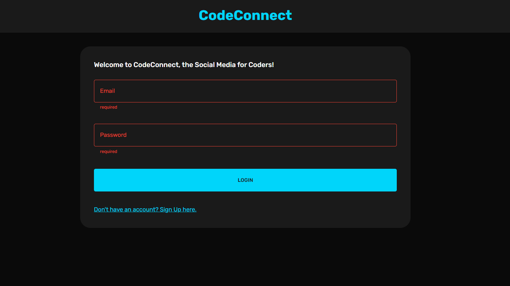
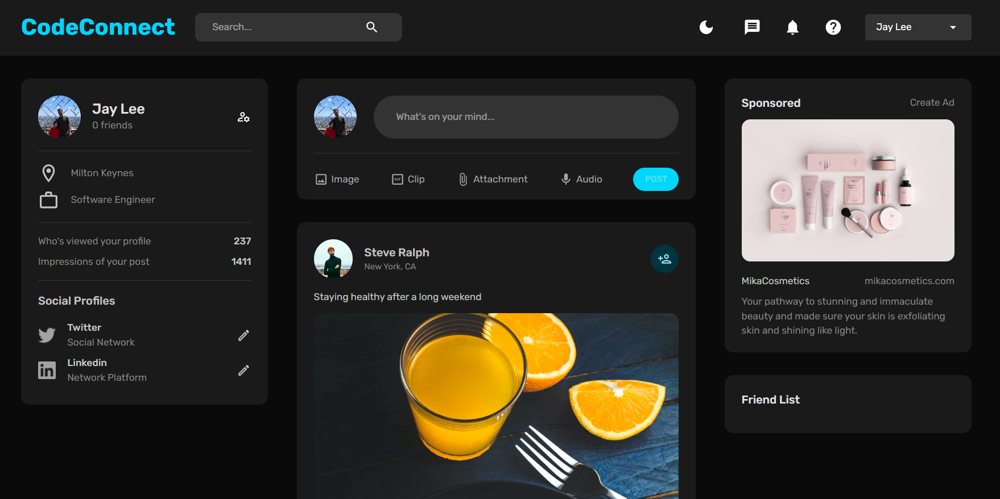

# CodeConnect 

CodeConnect is a social media platform developed for coders using the MERN stack. 👨‍💻
This is a full-stack Social Media application built using the MERN stack, which stands for MongoDB, Express, React, and Node.js. The client folder contains the frontend of the application built using React and Formik and other libraries, while the backend is in a folder called server that uses Express, Mongoose, Bcrypt, and other libraries.

### Login Page

### Main Application

## Getting Started
To get started with this project, follow the steps below.

## Prerequisites
You need to have Node.js and MongoDB installed on your machine.

## Installing
* Clone the repository
* Install server dependencies using npm install in the server folder
* Install client dependencies using npm install in the client folder
* Create a .env file in the server folder and add the following variables:
MONGO_URL=<your_mongodb_url>
JWT_SECRET=<your_jwt_secret>
PORT=<your_server_port>

## Running the Application
* Start the server by running npm start in the server folder
* Start the client by running npm start in the client folder
* The application will be accessible at http://localhost:3000.

## Features
The application provides the following features:

* User authentication using JSON Web Tokens (JWT)
* Ability to register a new user
* Ability to create, read, update, and delete posts
* Ability to like and comment on posts
* Real-time updates using web sockets

## Built With
* MongoDB - NoSQL database used to store data
* Express - Node.js web application framework used to build the backend
* React - JavaScript library used to build the frontend
* Node.js - JavaScript runtime used to build the backend
* Socket.io - Library used for real-time updates
* Bcrypt - Library used for password hashing
* Formik - Library used for building forms

## License
This project is licensed under the MIT License - see the LICENSE.md file for details.

